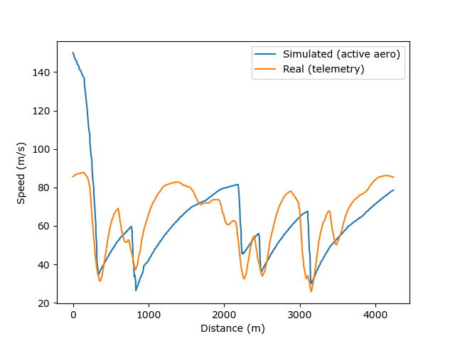
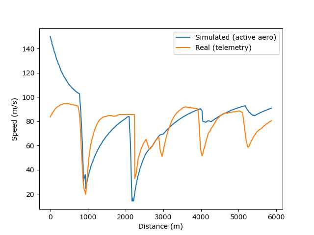
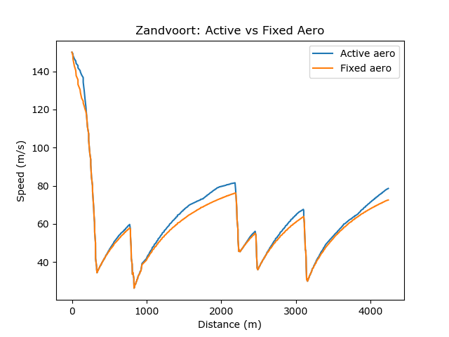
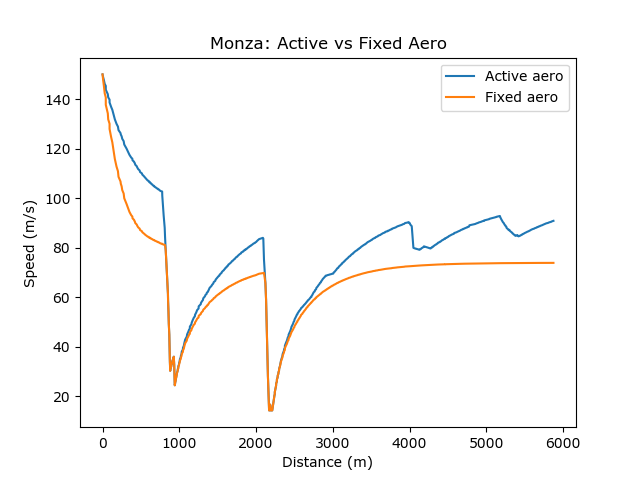

# F1 Lap Time Simulator — Active Aero (2026 Regulations)

**Question:** How much lap time does 2026's active aerodynamics (X-mode on
straights, Z-mode in corners) save compared to a fixed-aero car — and does
that saving depend on the type of circuit?

**Answer:** Active aero saves **2.34s** at Zandvoort (a corner-dense
circuit) but **9.93s** at Monza (a power circuit) — roughly **4x more
benefit** where there's more straight-line distance to exploit reduced
drag. This matches the physical intuition behind the regulation change:
active aero pays off in proportion to how much of the lap is spent at high
speed on straights.

---

## Method

A point-mass lap time simulator built from real 2026 F1 telemetry
(via [FastF1](https://github.com/theOehrly/Fast-F1)):

1. **Track model** — corner curvature computed from real GPS position data
   (X/Y), smoothed with a Savitzky-Golay filter, giving a continuous radius
   of curvature at every point around the lap.
2. **Vehicle model** — a point-mass car with two aerodynamic states:
   - **Z-mode** (corners): high downforce, high drag
   - **X-mode** (straights): lower downforce, lower drag — the 2026
     active-aero straight-line mode
3. **Speed profile** — solved via the standard forward-backward pass
   method: a cornering-grip limit at every point (solved numerically, since
   downforce depends on speed), a forward pass simulating power/traction-
   limited acceleration out of corners, and a backward pass simulating
   braking into corners. The final speed at each point is the minimum of
   all three constraints.
4. **Validation** — each circuit's simulated lap time is checked against
   the real 2026 qualifying pole lap for that circuit, with vehicle
   parameters (tyre grip, drag coefficients) tuned until the model's speed
   trace matches the real telemetry to within ~5%.
5. **Comparison** — each circuit is run twice: once with active aero
   (mode-switching based on track curvature) and once with a fixed-aero
   baseline (always in Z-mode, representing a pre-2026-style car), giving
   a direct measure of the active-aero lap time benefit.

**Validation — simulated vs real speed trace:**

## Results

| | Zandvoort (corner-dense) | Monza (power circuit) |
|---|---|---|
| Real 2026 qualifying pole | 71.16s | 81.79s |
| Simulated (active aero) | 75.10s | 85.08s |
| **Validation gap** | +3.94s (5.5%) | +3.30s (4.0%) |
| Simulated (fixed aero) | 77.44s | 95.02s |
| **Active aero saving** | **2.34s** | **9.93s** |

**Active vs fixed aero speed traces:**

A notable real-world detail: Monza's real pole was Gasly's maiden F1 pole
position — a genuine shock result on the weekend this data was pulled.

## Modelling insight: track-specific aero setup

The two circuits could not be validated using the same vehicle parameters.
Zandvoort (high-downforce circuit) and Monza (lowest-downforce circuit of
the season) needed separate calibrations — reflecting a real, documented
engineering decision: F1 teams run track-specific wing packages, not a
single fixed setup all season. Reusing Zandvoort's calibrated aero
coefficients at Monza initially produced a 15% validation error; giving
Monza its own lower-downforge baseline (representing a real low-drag wing
package) brought the model back in line with the same ~4-5% standard of
fit used at Zandvoort.

## Limitations

- **Single global friction coefficient.** The model cannot simultaneously
  represent a flowing corner (Zandvoort) and an extremely tight chicane
  (Monza) with one grip value — a known simplification, since real tyres
  generate relatively more grip at low speed than a flat coefficient
  implies.
- **Track-loop boundary artifact.** The curvature calculation has no
  knowledge that a lap is a closed loop, causing a brief, unrealistic speed
  spike right at the start/finish line in the raw model output.
- **No thermal tyre model, fuel load, traffic, or driver error margin** —
  the model assumes idealised, perfectly consistent grip and braking
  throughout, which is part of why the simulated lap is consistently
  slightly slower than the real pole lap (a real driver and car have
  variability the model doesn't need to account for).
- **Simplified curvature-based aero switching.** The active-aero
  mode-switch is based on a corner-radius threshold, not the specific
  track-zone logic real teams use.
- **Numerical sensitivity on long straights.** Near-zero curvature on very
  long straights (particularly at Monza) can produce small floating-point
  artifacts in the curvature calculation, requiring a validated radius
  floor to filter out non-physical results.

## Repository contents

- `lap_sim.ipynb` — full notebook: track modelling, vehicle model, speed
  profile calculation, validation, and active-vs-fixed aero comparison for
  both circuits
- `zandvoort_telemetry.csv`, `monza_telemetry.csv` — real 2026 qualifying
  telemetry used for track modelling and validation

## Possible extensions

- Monte Carlo sensitivity analysis over aero and grip parameters, to give
  the lap time saving as a distribution rather than a point estimate
- A third circuit type (e.g. a balanced circuit) to test whether the
  active-aero benefit scales smoothly with straight-line proportion or
  behaves differently
- A more detailed active-aero switching model based on defined track
  zones rather than a curvature threshold
